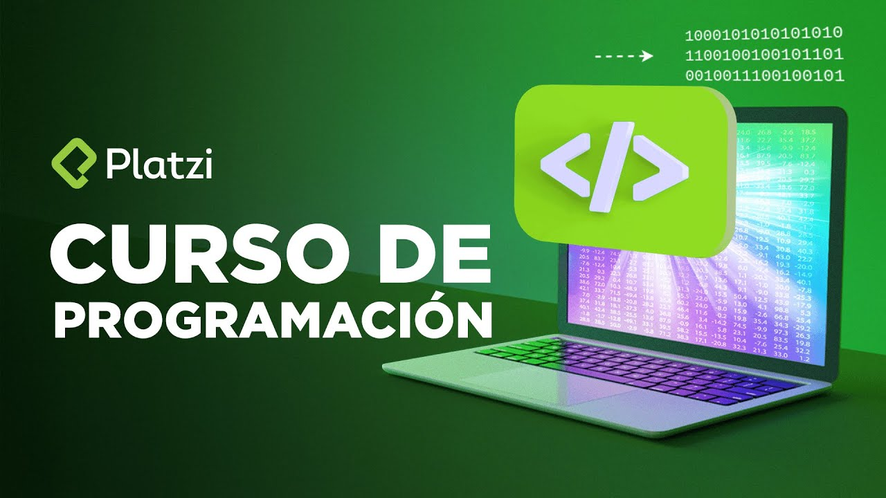

# CURSO DE PROGRAMACIÓN DESDE CERO DE PLATZI

En este curso trabajaremos desde los elementos más básicos de la programación hasta la creación de un proyecto haciendo uso de los tres lenguajes del FrotnEnd, HTML, CSS y JavaScript.

---

---

## Qué Necesitas?
